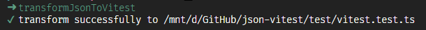

## transform-json-to-vitest
通过json生成vitest文件

## 安装
```bash
npm install -g transform-json-to-vitest
```  

## 注意
执行命令目录下需要配置vitest.json文件，详见[vitest.json](./vitest.json)文件
```md
# demo
{
  "name": "vitest", // 生成test目录下的文件名
  "dependency": "import { describe, it, expect, test } from 'vitest'", // 依赖,如果有额外依赖，可以在这里配置
  "describe": [ // 生成describe('name',async ()=>{})
    {
      "name": "hi",
      "type": "async", // 控制是否使用async方法
      "command": "skip",
      "it": [ // it('name', ()=>...)
        {
          "expression": "const a = 2", // 可在这里申明或调用变量
          "name": "should works",
          "expect": "a", // a使用的是expression提供的变量, expect(a).toEqual(2)
          "to": "toEqual",
          "result": "2"
        }
      ],
      "test": [
        {
          "expression": "const a = 2",
          "name": "should works",
          "expect": "a",
          "to": "toEqual",
          "result": "2"
        }
      ]
    },
    {
      "name": "hi",
      "type": "async",
      "it": [
        {
          "expression": "const a = 2",
          "name": "should works",
          "expect": "a",
          "to": "toEqual",
          "result": "2"
        },
        {
          "expression": "const a = 2",
          "name": "should works",
          "expect": "a",
          "to": "toMatchInlineSnapshot",
          "result": ""
        }
      ]
    }
  ]
}

```

## 命令
全局安装后可直接运行： transformJsonToVitest

